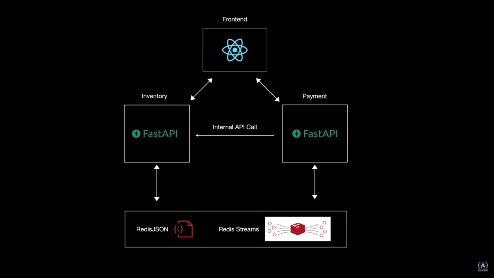

# [Microservices with FastAPI – Full Course](https://www.youtube.com/watch?v=Cy9fAvsXGZA&list=PLSgXVDIP21EFTuITVB6QHKhln0AWRT0Q8&index=2)




```
Table of Content

⭐️ Course Contents ⭐️
⌨️ (00:00) Intro
⌨️ (01:30) App Demo
⌨️ (03:29) Inventory Microservice Setup
⌨️ (05:46) Redis Cloud
⌨️ (07:13) Connect to Redis Cloud
⌨️ (09:04) Products CRUD
⌨️ (20:05) Payment Microservice Setup
⌨️ (25:40) Internal Http Requests
⌨️ (30:54) Background Tasks
⌨️ (36:50) Redis Streams
⌨️ (58:34) Frontend
```
